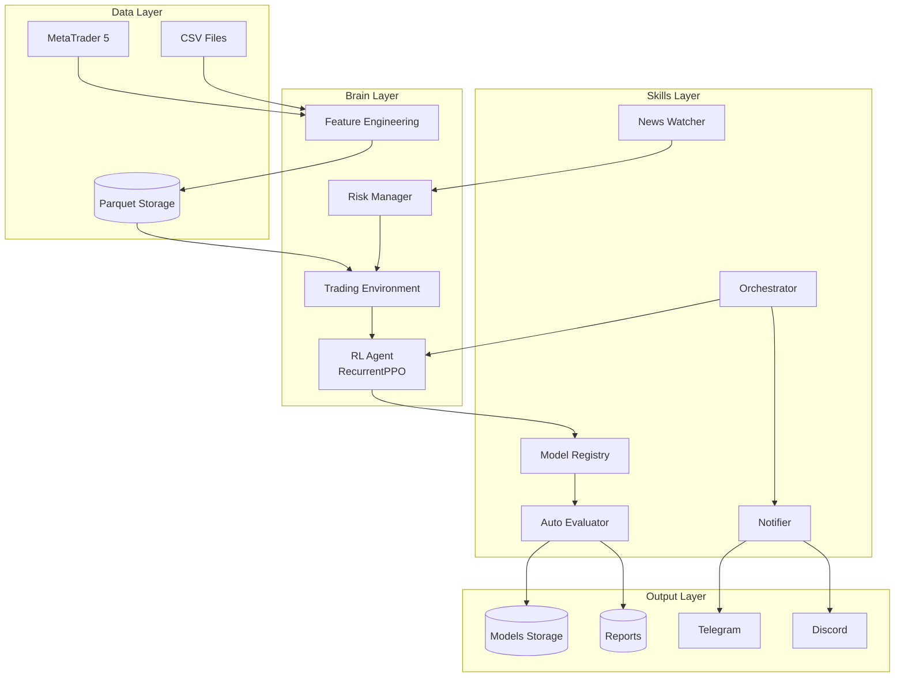

# NeuroTrader V4 - Complete System Documentation
# เอกสารโครงสร้างและการทำงานของระบบ NeuroTrader อย่างละเอียด

---

## 📋 สารบัญ (Table of Contents)

1. [ภาพรวมระบบ (System Overview)](#1-ภาพรวมระบบ)
2. [โครงสร้างโปรเจค (Project Structure)](#2-โครงสร้างโปรเจค)
3. [Core Components](#3-core-components)
4. [Data Flow & Pipeline](#4-data-flow--pipeline)
5. [The Trinity System](#5-the-trinity-system)
6. [Skills & Automation](#6-skills--automation)
7. [Dependencies & Tech Stack](#7-dependencies--tech-stack)
8. [CLI Commands](#8-cli-commands)

---

## 1. ภาพรวมระบบ

NeuroTrader เป็นระบบ **Algorithmic Trading** ที่ใช้ **Reinforcement Learning (RL)** เพื่อตัดสินใจซื้อขายในตลาดการเงิน โดยมีคุณสมบัติเด่น:

| คุณสมบัติ | คำอธิบาย |
|-----------|----------|
| **Multi-Agent System** | 3 บุคลิกเทรด: Scalper, Swing, Trend |
| **LSTM Memory** | โมเดลจำ pattern ย้อนหลังได้ |
| **Risk Management** | ระบบ Circuit Breaker, Daily Stop, Turbulence |
| **MT5 Integration** | เชื่อมต่อ MetaTrader 5 แบบ real-time |
| **AutoPilot** | เทรนและประเมินโมเดลอัตโนมัติ |

```
┌─────────────────────────────────────────────────────────────┐
│                    NEUROTRADER V4                          │
├─────────────────────────────────────────────────────────────┤
│  DATA          BRAIN              BODY          OUTPUT     │
│  ┌──────┐     ┌──────────┐       ┌──────┐      ┌──────┐   │
│  │ MT5  │────▶│FeatureEng│──────▶│TradEnv│────▶│RLAgent│   │
│  │ Data │     │+ OHLCV   │       │+ Risk │     │ LSTM  │   │
│  └──────┘     └──────────┘       └──────┘      └───┬──┘   │
│                                                     │      │
│  ┌──────┐     ┌──────────┐       ┌──────┐      ┌───▼──┐   │
│  │Models│◀────│ Registry │◀──────│Eval  │◀─────│Action │   │
│  │Store │     │ Version  │       │Score │      │0/1/2  │   │
│  └──────┘     └──────────┘       └──────┘      └──────┘   │
└─────────────────────────────────────────────────────────────┘
```

---

## 2. โครงสร้างโปรเจค

```
NeuroTrader/
├── src/                          # Source Code หลัก
│   ├── brain/                    # สมอง (AI/ML)
│   │   ├── env/                  # Trading Environment
│   │   │   └── trading_env.py    # Gymnasium Environment
│   │   ├── feature_eng.py        # Feature Engineering (TA)
│   │   ├── rl_agent.py           # RL Agent (PPO/LSTM)
│   │   ├── risk_manager.py       # Risk Management
│   │   ├── train.py              # Training Logic
│   │   └── walk_forward.py       # Walk-Forward Validation
│   │
│   ├── body/                     # ร่างกาย (Broker Connection)
│   │   ├── mt5_driver.py         # MetaTrader 5 Driver
│   │   ├── sanity.py             # Health Checks
│   │   └── stealth.py            # Anti-Detection
│   │
│   ├── skills/                   # ความสามารถพิเศษ
│   │   ├── model_registry.py     # Model Versioning
│   │   ├── auto_evaluator.py     # Auto Post-Training Eval
│   │   ├── training_orchestrator.py  # Training Pipeline
│   │   ├── notifier.py           # Telegram/Discord Alerts
│   │   ├── news_watcher.py       # Economic Calendar
│   │   └── reporter.py           # Report Generation
│   │
│   ├── memory/                   # ความจำ
│   │   ├── cache.py              # Data Caching
│   │   └── storage.py            # Persistent Storage
│   │
│   ├── utils/                    # Utilities
│   │   ├── logger.py             # Logging
│   │   ├── telegram_bot.py       # Telegram Integration
│   │   ├── discord_bot.py        # Discord Integration
│   │   └── metrics.py            # Performance Metrics
│   │
│   ├── neuro_nautilus/           # NautilusTrader Integration
│   │   ├── strategy.py           # Trading Strategy
│   │   ├── runner.py             # Backtest Runner
│   │   └── config.py             # Configuration
│   │
│   ├── analysis/                 # Analysis Tools
│   │   └── behavior.py           # Behavioral Metrics
│   │
│   └── main.py                   # Main Entry Point
│
├── scripts/                      # Automation Scripts
│   ├── autopilot.py              # Unified CLI
│   ├── train_trinity.py          # Train Models
│   ├── tune_trinity.py           # Hyperparameter Tuning
│   ├── backtest_trinity.py       # Backtesting
│   ├── fetch_multi_asset.py      # Data Fetching
│   └── paper_trade_xauusdm.py    # Paper Trading
│
├── config/                       # Configuration Files
│   └── training_config.yaml      # Training Pipeline Config
│
├── data/                         # Data Storage
│   └── processed/                # Processed Parquet Files
│       ├── XAUUSD_M5_processed.parquet
│       ├── XAUUSD_H1_processed.parquet
│       └── ...
│
├── models/                       # Trained Models
│   ├── checkpoints/              # Training Checkpoints
│   ├── scalper/                  # Scalper Versions
│   ├── swing/                    # Swing Versions
│   └── trend/                    # Trend Versions
│
├── docs/                         # Documentation
├── tests/                        # Unit Tests
├── reports/                      # Generated Reports
└── logs/                         # Training Logs
```

---

## 3. Core Components

### 3.1 Feature Engineering (`src/brain/feature_eng.py`)

แปลงข้อมูล OHLCV ดิบให้เป็น Features ที่ AI เข้าใจได้

**Features ที่สร้าง:**

| Category | Features | Description |
|----------|----------|-------------|
| **Price Action** | `body_size`, `upper_wick`, `lower_wick`, `is_bullish` | รูปร่างแท่งเทียน |
| **Trend** | `ema_9`, `ema_21`, `ema_50`, `ema_200`, `dist_ema_*` | Moving Averages |
| **Momentum** | `rsi`, `macd`, `macd_signal`, `stoch_k`, `stoch_d` | Oscillators |
| **Volatility** | `atr`, `atr_norm`, `bb_high`, `bb_low`, `bb_width` | Bollinger, ATR |
| **Time** | `hour_sin`, `hour_cos`, `day_sin`, `day_cos` | Cyclical Time Encoding |
| **Returns** | `log_ret`, `log_ret_lag_1`, `log_ret_lag_2` | Log Returns |
| **Risk** | `turbulence` | Mahalanobis Distance (Crash Detection) |

---

### 3.2 Trading Environment (`src/brain/env/trading_env.py`)

**สภาพแวดล้อมสำหรับ RL Agent ฝึกเทรด**

```python
class TradingEnv(gym.Env):
    """
    Action Space: Discrete(3)
        0 = HOLD
        1 = BUY (ซื้อ 99% ของ Balance)
        2 = SELL (ปิดทุก Position)
    
    Observation Space: Box(n_features + 2)
        - Technical Features (18 ตัว)
        - Balance
        - Position
    """
```

**Trinity Reward System:**

| Agent Type | Reward Formula | Purpose |
|------------|----------------|---------|
| **Scalper** | `log_return * 100 - exposure_penalty + momentum_bonus` | เน้น PnL + ปิดไว |
| **Swing** | `0.7*PnL + 0.1*Sharpe + 0.1*Holding` | เน้นจับ Trend |
| **Trend** | `0.5*PnL + 0.3*Sharpe + 0.1*DD_penalty` | เน้น Risk-Adjusted |

**Risk Integration:**
- Circuit Breaker (หยุดเมื่อ Drawdown > 20%)
- Daily Stop (หยุดเมื่อขาดทุน > 5%/วัน)
- Position Limit (Max 2x Initial Balance)
- News Filter (หยุดก่อนข่าวใหญ่ 30 นาที)

---

### 3.3 RL Agent (`src/brain/rl_agent.py`)

**โมเดล AI ที่ตัดสินใจซื้อขาย**

```python
class RLAgent:
    """
    - Algorithm: RecurrentPPO (LSTM-based PPO)
    - Policy: MlpLstmPolicy
    - Supports Ensemble (PPO + A2C)
    """
    
    def decide_action(self, observation) -> int:
        """Returns: 0=HOLD, 1=BUY, 2=SELL"""
        
    def process_bar(self, bar_dict, portfolio_state):
        """Process incoming candle, return (action, turbulence)"""
```

**Model Discovery:**
- Auto-finds latest model in `models/checkpoints/`
- Fallback chain: Best → Latest → Default

---

### 3.4 Risk Manager (`src/brain/risk_manager.py`)

**ระบบป้องกันความเสี่ยง**

```python
class RiskManager:
    # Hard Limits
    max_lots_per_trade = 1.0          # Max lot size
    daily_loss_limit_pct = 0.05       # 5% daily stop
    max_drawdown_limit_pct = 0.20     # 20% circuit breaker
    turbulence_limit = 15.0           # Crash detection
    
    def check_order(symbol, volume, order_type, current_time):
        """
        Returns True if order is allowed
        Checks: Circuit Breaker, Daily Stop, Turbulence, News
        """
```

**State Machine:**
```
NORMAL → DAILY_STOP → CIRCUIT_BREAKER
           ↑              ↑
    -5% Daily Loss   -20% Drawdown
```

---

### 3.5 MT5 Driver (`src/body/mt5_driver.py`)

**เชื่อมต่อกับ MetaTrader 5**

```python
class MT5Driver:
    def initialize()          # Connect to MT5
    def fetch_history()       # Get historical data
    def get_latest_data()     # Get latest tick
    def get_account_info()    # Balance, Equity
    def get_positions()       # Open positions
    def execute_trade()       # Send order
    def _send_order()         # Raw order to MT5
```

**Timeframe Mapping:**
| Code | MT5 Constant |
|------|--------------|
| M1 | TIMEFRAME_M1 |
| M5 | TIMEFRAME_M5 |
| H1 | TIMEFRAME_H1 |
| D1 | TIMEFRAME_D1 |

---

## 4. Data Flow & Pipeline

### 4.1 Training Pipeline

```
[MT5 / CSV] 
    ↓ fetch_multi_asset.py
[Raw OHLCV]
    ↓ feature_eng.py
[Features DataFrame]
    ↓ TradingEnv
[Gymnasium Environment]
    ↓ RecurrentPPO.learn()
[Trained Model .zip]
    ↓ ModelRegistry
[Versioned Storage]
    ↓ AutoEvaluator
[Metrics + Report]
    ↓ Notifier
[Telegram/Discord Alert]
```

### 4.2 Live Trading Pipeline

```
[MT5 Real-time Tick]
    ↓ MT5Driver.get_latest_data()
[Bar Dict]
    ↓ RLAgent.process_bar()
[Action + Turbulence]
    ↓ RiskManager.check_order()
[Allowed/Blocked]
    ↓ MT5Driver.execute_trade()
[Order Sent to Broker]
```

---

## 5. The Trinity System

**3 Agent Personalities สำหรับสภาวะตลาดต่างๆ**

### 5.1 Scalper (⚔️ นักล่าระยะสั้น)

| Property | Value |
|----------|-------|
| **Timeframe** | M5, M15 |
| **Holding Time** | **Max 36 steps (3 ชม.)** - Force Exit |
| **Gamma** | **0.80** (Short-term focus) |
| **Strategy** | **Sniper / Hit & Run** |
| **Reward** | `Realized PnL ONLY - Sniper Penalty` |

### 5.2 Swing (🛡️ นักจับคลื่น)

| Property | Value |
|----------|-------|
| **Timeframe** | H1, H4 |
| **Holding Time** | ชั่วโมง - วัน |
| **Gamma** | 0.95 |
| **Strategy** | Ride Trends |
| **Reward** | `0.7*PnL + 0.1*Sharpe` |

### 5.3 Trend (👑 นักสะสมทรัพย์)

| Property | Value |
|----------|-------|
| **Timeframe** | D1 |
| **Holding Time** | วัน - สัปดาห์ |
| **Gamma** | 0.999 (long-term) |
| **Strategy** | Buy & Hold |
| **Reward** | `0.5*PnL + 0.3*Sharpe + DD_penalty` |

---

## 6. Skills & Automation

### 6.1 Model Registry (`src/skills/model_registry.py`)

**เก็บ Version โมเดลพร้อม Metadata**

```
models/
├── registry.json              # Master Index
├── scalper/
│   ├── v001/
│   │   ├── model.zip
│   │   ├── metadata.json
│   │   └── backtest.csv
│   ├── v002/
│   └── best/ → v002/          # Symlink to best
```

**API:**
```python
registry.register_model(path, role, metrics)
registry.get_best(role) → ModelInfo
registry.auto_promote_if_better(role, version, metric)
```

---

### 6.2 Auto-Evaluator (`src/skills/auto_evaluator.py`)

**ประเมินโมเดลอัตโนมัติหลังเทรน**

**Evaluation Criteria:**

| Role | Primary Metric | Threshold | Higher is Better |
|------|---------------|-----------|------------------|
| Scalper | avg_holding_time | < 20 steps | ❌ |
| Swing | sharpe_ratio | > 1.0 | ✅ |
| Trend | total_return | > 5% | ✅ |

---

### 6.3 Training Orchestrator (`src/skills/training_orchestrator.py`)

**ควบคุม Pipeline ทั้งหมด**

```yaml
# config/training_config.yaml
roles:
  scalper:
    timeframes: ["M5", "M15"]
    symbols: ["XAUUSD"]
    hyperparams:
      gamma: 0.85
      learning_rate: 0.0003
```

---

### 6.4 Notifier (`src/skills/notifier.py`)

**แจ้งเตือนผ่าน Telegram/Discord**

Events:
- `TRAINING_STARTED`
- `CHECKPOINT_SAVED`
- `TRAINING_COMPLETE`
- `MODEL_PROMOTED`
- `TRAINING_FAILED`

---

### 6.5 News Watcher (`src/skills/news_watcher.py`)

**ติดตามข่าวเศรษฐกิจ**

- Connects to Forex Factory / Investing.com
- Detects High Impact News (FOMC, NFP, CPI)
- Blocks trading 30 mins before critical news

---

## 7. Dependencies & Tech Stack

| Category | Library | Purpose |
|----------|---------|---------|
| **RL** | stable-baselines3, sb3-contrib | PPO, RecurrentPPO |
| **Env** | gymnasium | Trading Environment |
| **Data** | pandas, numpy, pyarrow | Data Processing |
| **TA** | ta | Technical Indicators |
| **Broker** | MetaTrader5 | MT5 Connection |
| **Backtest** | nautilus_trader | Professional Backtesting |
| **Tuning** | optuna | Hyperparameter Optimization |
| **Config** | pyyaml | Configuration |
| **Alerts** | discord.py, requests | Notifications |

---

## 8. CLI Commands

### AutoPilot CLI (`scripts/autopilot.py`)

```powershell
# เทรนทุก Role
python scripts/autopilot.py train --all

# เทรนเฉพาะ Scalper
python scripts/autopilot.py train --role scalper

# Resume ที่หยุดไว้
python scripts/autopilot.py resume

# ดูสถานะ
python scripts/autopilot.py status

# เปรียบเทียบ Versions
python scripts/autopilot.py compare --role scalper

# Quick Train
python scripts/autopilot.py quick --role scalper --steps 500000

# Hyperparameter Tuning
python scripts/autopilot.py tune --role scalper --data /path/to/data --trials 20
```

### Direct Scripts

```powershell
# Train
python scripts/train_trinity.py --role scalper --data data/processed/XAUUSD_M5_processed.parquet --steps 1000000 --resume

# Backtest
python scripts/backtest_trinity.py --role scalper --data data/processed/XAUUSD_M5_processed.parquet --model models/trinity_scalper_best.zip

# Fetch Data
python scripts/fetch_multi_asset.py
```

---

## 📊 System Diagram



---

**Document Version:** 1.0  
**Last Updated:** 2026-01-24  
**Author:** AI Assistant (Antigravity)
