```mermaid
gantt
    title Scalper V2.6 Implementation
    dateFormat X
    axisFormat %s
    
    section Phase 1
    Modify training_config.yaml      :a1, 0, 1
    Modify trading_env.py           :a2, 1, 2
    
    section Phase 2  
    Run pytest tests                :b1, 2, 3
    Train V2.6 (1M steps)           :b2, 3, 6
    
    section Phase 3
    Evaluate on Test Set            :c1, 6, 7
    Compare with V2.3               :c2, 7, 8
```

# 🛠️ แผนแก้ไขปัญหา Scalper Model (V2.6)

> **สถานะปัจจุบัน:** V2.5 หยุดที่ 100k steps | V2.3 ทำกำไร +4% แต่ถือ 16 ชม.
> **เป้าหมาย:** ลด Avg Holding Time เหลือ < 2 ชม. โดยยังคงกำไร

---

## 🔍 วิเคราะห์ปัญหา

### ประวัติการทดลอง

| Version | กลยุทธ์ | Trades | Return | Avg Hold | ผลลัพธ์ |
|---------|---------|--------|--------|----------|---------|
| V2.1 | Research-Based | 1 | +0.53% | 50 steps | ❌ Passive มากเกินไป |
| V2.2 | Aggressive Penalty | 0 | 0% | - | ❌ ไม่เทรดเลย |
| V2.3 | Entry Bonus (+0.05) | 51 | **+4.15%** | 194 steps (16h) | ✅ กำไร แต่ถือนาน |
| V2.4 | Exponential Decay | 2 | -0.87% | 211 steps | ❌ กลัว decay จนไม่เข้า |
| V2.5 | Linear Decay (0.05) | - | - | - | ⏸️ หยุดที่ 100k |

### สาเหตุที่แท้จริง

> [!CAUTION]
> **Critical Parameter:** `n_steps=256` ใน PPO config
> 
> PPO Agent มองไปข้างหน้า **256 steps × 5 นาที = 21 ชั่วโมง!**
> ทำให้โมเดลเห็นว่า "ถือต่อ" ให้ผลตอบแทนรวมดีกว่า "ปิดเร็ว"

---

## 📋 แผนการแก้ไข

### Phase 1: ปรับ Hyperparameters (Scalper V2.6)

#### [MODIFY] [training_config.yaml](file:///C:/Users/pp/.gemini/antigravity/scratch/NeuroTrader/config/training_config.yaml)

```diff
roles:
  scalper:
    description: "Short-term trader for quick profits"
    timeframes: ["M5", "M15"]
    symbols: ["XAUUSD"]
    
    # Evaluation criteria
    eval_metric: "avg_holding_time"
    eval_threshold: 20  # steps, lower is better
    higher_is_better: false
    
    hyperparams:
      gamma: 0.85
      learning_rate: 0.0003
-     n_steps: 256
+     n_steps: 64          # 5 hours horizon (ก่อน 21 ชม.)
      batch_size: 64
-     ent_coef: 0.01
+     ent_coef: 0.02       # เพิ่มการ explore นิดหน่อย
```

**เหตุผล:**
- `n_steps=64` → Agent มองแค่ **5 ชั่วโมง** แทน 21 ชม.
- `ent_coef=0.02` → กระตุ้นให้ลองกลยุทธ์ใหม่

---

### Phase 2: ปรับ Reward Function

#### [MODIFY] [trading_env.py](file:///C:/Users/pp/.gemini/antigravity/scratch/NeuroTrader/src/brain/env/trading_env.py)

```diff
elif self.agent_type == 'scalper':
    # SCALPER V2.6 (SHORT-SIGHTED)
    
    # 1. PnL (Continuous)
    reward = log_return * 20.0 
    
    # 2. Entry Bonus (Critical for Activity)
    if trade_info is not None and trade_info.get('action') == 'BUY':
         reward += 0.05

-   # 3. Steeper Linear Time Decay
-   if self.position > 0 and self.steps_in_position > 12:
-       excess = self.steps_in_position - 12
-       decay = excess * 0.05 
-       reward -= decay

+   # 3. Balanced Time Decay (V2.6)
+   # เริ่มที่ 6 bars (30 นาที) แทน 12 bars
+   if self.position > 0 and self.steps_in_position > 6:
+       excess = self.steps_in_position - 6
+       decay = excess * 0.02  # ลดจาก 0.05 → 0.02
+       reward -= decay

+   # 4. Speed Bonus: ให้รางวัลถ้าปิดเร็วพร้อมกำไร
+   if trade_info is not None and trade_info.get('action') == 'SELL':
+       if log_return > 0 and self.steps_in_position < 24:  # < 2 ชม.
+           speed_bonus = 0.1 * (24 - self.steps_in_position) / 24.0
+           reward += speed_bonus

    # 5. Force Exit Penalty
    if trade_info is not None and trade_info.get('action') == 'FORCE_SELL':
        reward -= self.force_exit_penalty
```

**เหตุผล:**
- **Decay เริ่มเร็วขึ้น** (30 นาที แทน 1 ชม.)
- **Decay อ่อนลง** (0.02 แทน 0.05) เพื่อไม่ให้กลัวเกินไป
- **Speed Bonus ใหม่** → ให้รางวัลเพิ่มถ้าปิดภายใน 2 ชม. พร้อมกำไร

---

### Phase 3: สร้างสคริปต์ทดสอบ V2.6

#### [NEW] [scripts/train_v26_experiment.py](file:///C:/Users/pp/.gemini/antigravity/scratch/NeuroTrader/scripts/train_v26_experiment.py)

สคริปต์สำหรับเปรียบเทียบ n_steps 3 ค่า:
- **Experiment A:** n_steps=32 (2.5 ชม.)
- **Experiment B:** n_steps=64 (5 ชม.) ⭐ แนะนำ
- **Experiment C:** n_steps=128 (10 ชม.)

---

## ✅ Verification Plan

### Automated Tests

```powershell
# 1. ตรวจสอบ Gym API Compliance
cd C:\Users\pp\.gemini\antigravity\scratch\NeuroTrader
python -m pytest tests/test_env_sanity.py -v

# 2. ตรวจสอบ Feature Consistency  
python -m pytest tests/test_feature_consistency.py -v

# 3. เทรน Quick Test (50k steps)
python scripts/autopilot.py quick --role scalper --steps 50000
```

### Manual Verification (Post-Training)

หลังเทรนเสร็จ 1M steps ให้รัน:

```powershell
# Evaluate Test Set
python scripts/autopilot.py evaluate \
  --model models/checkpoints/scalper_XAUUSD_M5/latest.zip \
  --data data/processed/XAUUSD_M5_processed.parquet \
  --role scalper
```

**Success Criteria:**

| Metric | Target | V2.3 Baseline |
|--------|--------|---------------|
| Trades | > 30 | 51 |
| Return | > +2% | +4.15% |
| Avg Holding | **< 48 steps (4h)** | 194 steps ❌ |
| Win Rate | > 50% | 66.67% |

---

## 🗺️ Roadmap



---

## ⚠️ User Review Required

1. **n_steps ค่าไหนดี?** เสนอ 64 แต่ถ้าต้องการ aggressive กว่านี้อาจลองเป็น 32
2. **Speed Bonus** ควรให้เท่าไหร่? เสนอ max 0.1 (ถ้าปิดทันที)
3. **ต้องการรันทั้ง 3 Experiments พร้อมกันไหม?** หรือเลือก 1 ตัวก่อน

---

> 📁 **Files to Change:**
> - `config/training_config.yaml`
> - `src/brain/env/trading_env.py`
> - (Optional) `scripts/train_v26_experiment.py`
