# 🧠 วิเคราะห์ระบบ NeuroTrader และกลยุทธ์การเทรด

> รายงานการวิเคราะห์ระบบ AI Trading แบบครบถ้วน

---

## 📊 สรุปภาพรวมระบบ

NeuroTrader เป็นระบบเทรดอัตโนมัติที่ใช้ **Reinforcement Learning (PPO Algorithm)** ในการตัดสินใจซื้อขาย โดยมีสถาปัตยกรรมแบบ **Brain-Body Architecture** แยกส่วนการคิดตัดสินใจ (Brain) ออกจากการดำเนินการ (Body/MT5 Driver)

### องค์ประกอบหลัก

```mermaid
graph TB
    subgraph Brain["🧠 Brain Layer"]
        A[RLAgent<br/>PPO/A2C Ensemble] --> B[FeatureRegistry<br/>19 Technical Indicators]
        A --> C[RiskManager<br/>Multi-layer Protection]
        A --> D[TradingEnv<br/>Gymnasium Environment]
    end
    
    subgraph Body["🦾 Body Layer"]
        E[MT5Driver<br/>MetaTrader 5 Connector]
    end
    
    Brain --> Body
```



---

## 🎯 กลยุทธ์การเทรด: ระบบ Trinity

ระบบใช้แนวคิด **Trinity Agents** คือ 3 โมเดลที่มีสไตล์การเทรดต่างกัน:

### 1️⃣ Scalper (ระยะสั้น)

| พารามิเตอร์ | ค่า | ความหมาย |
|------------|-----|----------|
| **Timeframes** | M5, M15 | เทรดระยะสั้นมาก 5-15 นาที |
| **Gamma** | 0.85 | เน้นผลตอบแทนในอนาคตอันใกล้ |
| **Holding Limit** | 36 bars | บังคับปิดออเดอร์หลัง 36 แท่ง |
| **Eval Metric** | avg_holding_time | ยิ่งปิดเร็วยิ่งดี |

**กลยุทธ์:**
- Entry Bonus: ให้รางวัล +0.05 เมื่อเปิดออเดอร์
- Time Decay: หลังถือ 12 bars จะถูกหักคะแนน 0.05 ต่อ bar
- Force Exit: บังคับปิดเมื่อถือเกิน 36 bars พร้อมหักคะแนน 1.0

### 2️⃣ Swing Trader (ระยะกลาง)

| พารามิเตอร์ | ค่า | ความหมาย |
|------------|-----|----------|
| **Timeframes** | H1, H4 | เทรดระยะกลาง 1-4 ชม. |
| **Gamma** | 0.95 | สมดุลระหว่างระยะสั้นและยาว |
| **Eval Metric** | sharpe_ratio | เน้นผลตอบแทนปรับความเสี่ยง |
| **Symbols** | XAUUSD, BTCUSD | เทรดทอง และ Bitcoin |

**กลยุทธ์:**
- เน้น PnL สูง (weight 0.7)
- รวม Sharpe Contribution
- Holding Reward สำหรับถือระหว่างกำไร

### 3️⃣ Trend Follower (ระยะยาว)

| พารามิเตอร์ | ค่า | ความหมาย |
|------------|-----|----------|
| **Timeframes** | D1 | เทรดรายวัน |
| **Gamma** | 0.999 | เน้นผลตอบแทนระยะยาวมาก |
| **Eval Metric** | total_return | ผลตอบแทนรวม |
| **Symbols** | XAUUSD, BTCUSD, DXY | รวม Dollar Index |

**กลยุทธ์:**
- Research-Based Reward Formula
- Differential Sharpe Ratio
- Drawdown Penalty (หนักเมื่อ drawdown > 5%)

---

## 📈 ระบบ Features (19 ตัวบ่งชี้)

```yaml
Technical Indicators:
  - RSI (14)              # แนวโน้ม overbought/oversold
  - MACD + Signal         # แนวโน้ม crossover
  - Bollinger Bands       # ความผันผวน + ตำแหน่งราคา
  - EMA 20/50             # แนวโน้มระยะสั้น/กลาง
  - ATR (14)              # ความผันผวน normalized
  - Stochastic K/D        # momentum
  - VWAP Distance         # ตำแหน่งราคาเทียบ volume

Price Action:
  - Log Return            # ผลตอบแทนล็อก
  - Body Size Norm        # ขนาดแท่งเทียน
  - Is Bullish            # +1 ขาขึ้น / -1 ขาลง
  - Normalized Volume     # volume เทียบค่าเฉลี่ย

Time Embeddings:
  - Hour Sin/Cos          # รอบเวลาใน 24 ชม.
  - Day Sin/Cos           # รอบวันในสัปดาห์
```

> ⚡ **จุดเด่น:** ใช้ Sin/Cos encoding สำหรับเวลา ทำให้โมเดลเรียนรู้รูปแบบตามเวลาได้ดี

---

## 🛡️ ระบบบริหารความเสี่ยง (Multi-Layer Protection)

```mermaid
flowchart TD
    A[📥 คำสั่งซื้อขาย] --> B{Circuit Breaker<br/>Drawdown > 20%?}
    B -->|ใช่| X[❌ บล็อกทุกคำสั่ง]
    B -->|ไม่| C{Daily Loss<br/>> 5%?}
    C -->|ใช่| X
    C -->|ไม่| D{Turbulence<br/>> 15?}
    D -->|ใช่| X
    D -->|ไม่| E{High-Impact News<br/>ใน 30 นาที?}
    E -->|ใช่| X
    E -->|ไม่| F{Volume > Limit?}
    F -->|ใช่| X
    F -->|ไม่| G[✅ อนุมัติคำสั่ง]
```



### รายละเอียดกฎความปลอดภัย:

| กฎ | Threshold | พฤติกรรม |
|----|-----------|----------|
| **Circuit Breaker** | Drawdown 20% | หยุดเทรดถาวร |
| **Daily Stop Loss** | ขาดทุน 5%/วัน | หยุดเทรดวันนั้น |
| **Turbulence Filter** | Index > 15 | ระงับคำสั่งชั่วคราว |
| **News Filter** | High Impact ±30นาที | ระงับคำสั่ง |
| **Dynamic Lot Size** | 5.0 lots ต่อ $10k | ขนาดตามทุน |

---

## 🤖 โครงสร้าง RL Agent

### Ensemble Support
ระบบรองรับการโหลดหลายโมเดล (PPO, A2C) และใช้ร่วมกัน:

```python
model_types = {
    'ppo': (PPO, "ppo_neurotrader.zip"),
    'a2c': (A2C, "a2c_neurotrader.zip"),
}
# Auto-discovery ถ้าไม่พบไฟล์ที่กำหนด
```

### PPO Training Parameters

| Parameter | Value | เหตุผล |
|-----------|-------|--------|
| Learning Rate | 0.0003 | ค่ามาตรฐานจากงานวิจัย |
| Gamma | 0.99 | เน้นระยะยาว (Trend) |
| N-Steps | 2048 | เสถียรภาพสูง |
| Batch Size | 64 | สมดุลความเร็ว/คุณภาพ |
| Entropy Coef | 0.01 | กระตุ้นการ explore |

---

## 📋 สรุปจุดแข็ง

1. ✅ **Multi-Agent System** - 3 สไตล์การเทรดครอบคลุม timeframe ต่างๆ
2. ✅ **Research-Based Rewards** - ใช้ Sharpe Ratio แทน pure PnL
3. ✅ **Multi-Layer Risk Management** - หลายชั้นความปลอดภัย
4. ✅ **Unified Feature Engine** - consistency ระหว่าง training/inference
5. ✅ **Smart Model Discovery** - auto-load โมเดลล่าสุด

## ⚠️ จุดที่ควรปรับปรุง

1. ❌ **Trading Env มีปัญหา Off-by-One** - คำนวณ equity หลัง step increment
2. ❌ **Feature Mismatch Risk** - ต้อง sync ระหว่าง env และ agent
3. ❌ **Performance Bottleneck** - สร้าง DataFrame ใหม่ทุก bar
4. ❌ **ไม่มี Unit Tests** - ขาด test coverage

---

## 💡 ข้อเสนอแนะ

### ระยะสั้น (Quick Wins)
- แก้ไข equity calculation timing ใน `trading_env.py`
- เพิ่ม validation ของ feature dimensions

### ระยะกลาง (Enhancement)
- Implement streaming feature calculation (ไม่ต้องสร้าง DataFrame ใหม่)
- เพิ่ม backtesting framework อัตโนมัติ

### ระยะยาว (Evolution)
- เพิ่ม Multi-Asset Ensemble voting
- Implement Walk-Forward Optimization
- เพิ่ม Sentiment Analysis จาก LLM

---

> 📁 **Project Location:** `C:\Users\pp\.gemini\antigravity\scratch\NeuroTrader`
